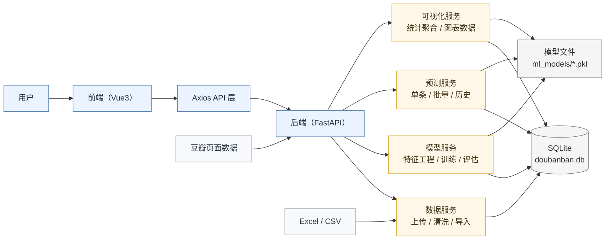
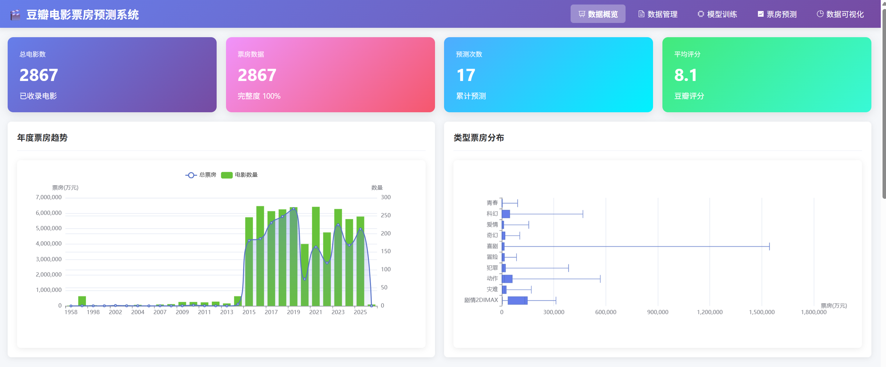
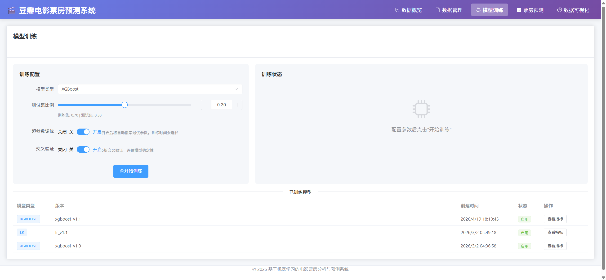
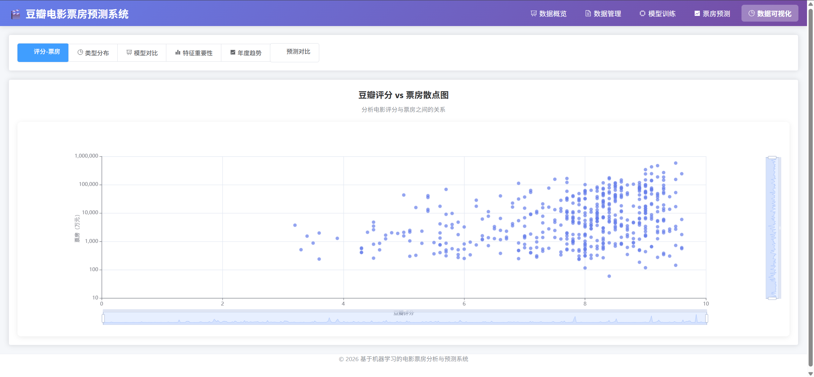

# 豆瓣电影票房预测及可视化分析系统

## 项目简介

本系统是基于机器学习的豆瓣电影票房预测及可视化分析平台，提供完整的数据获取、模型训练、预测和可视化功能。

### 核心功能

- **数据获取**：支持豆瓣爬虫爬取和Excel文件上传两种方式
- **模型训练**：集成线性回归、XGBoost等多种预测模型
- **票房预测**：单个电影预测和批量预测功能
- **数据可视化**：丰富的图表展示数据规律和模型性能

### 技术亮点

- 前后端分离架构，RESTful API设计
- 异步任务处理，支持长时间训练和爬取
- 特征工程自动化，相关性分析和VIF检验
- 模型性能对比，自动选择最优模型
- 响应式前端界面，支持多种数据可视化

## 项目架构



## 界面预览

### 数据概览


### 模型训练


### 数据可视化


## 技术栈

### 后端
- Python 3.10+
- FastAPI - 现代化Web框架
- SQLAlchemy - ORM框架
- Pandas/NumPy - 数据处理
- Scikit-learn - 基准机器学习模型
- XGBoost - 进阶预测模型
- Jieba/TextBlob - 中文NLP处理
- BeautifulSoup4 - 网页解析

### 前端
- Vue 3 - 前端框架
- Element Plus - UI组件库
- ECharts - 数据可视化
- Axios - HTTP客户端
- Pinia - 状态管理

## 快速开始

### 方式一：使用启动脚本（推荐）

**后端启动：**
```bash
cd backend
chmod +x start.sh
./start.sh
```

**前端启动（新终端）：**
```bash
cd frontend
chmod +x start.sh
./start.sh
```

### 方式二：手动启动

**1. 后端服务**
```bash
cd backend

# 安装依赖
pip install -r requirements.txt

# 启动服务
python3 -m uvicorn app.main:app --reload --host 0.0.0.0 --port 8000
```

**2. 前端服务（新终端）**
```bash
cd frontend

# 安装依赖
npm install

# 启动服务
npm run dev
```

### 访问地址

- **前端界面**: http://localhost:5173
- **API文档**: http://localhost:8000/docs
- **ReDoc**: http://localhost:8000/redoc

## 系统功能

### 1. 数据概览
- 系统统计数据展示
- 年度票房趋势图
- Top电影榜单
- 数据来源分布

### 2. 数据管理
- **爬虫采集**：
  - 配置年份范围、最低评分、最大爬取数
  - 实时显示爬取进度
  - 爬取历史记录查看
- **文件上传**：
  - 拖拽上传Excel文件
  - 数据预览和字段映射
  - 支持自定义字段配置
- **数据列表**：
  - 搜索和筛选功能
  - 分页显示
  - 查看详情和删除

### 3. 模型训练
- 支持多种模型选择（XGBoost/线性回归）
- 超参数自动调优
- 交叉验证评估
- 实时训练进度显示
- 训练日志记录
- 模型性能对比
- 特征重要性分析

### 4. 票房预测
- **单个预测**：
  - 选择已有电影或手动输入
  - 多模型预测支持
  - 置信区间计算
  - 特征贡献度展示
  - 实际票房对比
- **批量预测**：
  - Excel批量上传
  - 预测结果导出
- **预测历史**：
  - 历史记录查询
  - 预测结果查看

### 5. 数据可视化
- 评分-票房散点图
- 类型票房分布箱线图
- 模型性能对比柱状图
- 特征重要性横向柱状图
- 年度票房趋势折线图
- 预测vs实际对比图

## API接口

### 数据管理 (/api/data)
| 接口 | 方法 | 说明 |
|------|------|------|
| /api/data/upload | POST | 上传Excel文件 |
| /api/data/import | POST | 导入数据 |
| /api/data/movies | GET | 获取电影列表 |
| /api/data/movies/{id} | GET | 获取电影详情 |
| /api/data/movies | POST | 添加电影 |
| /api/data/movies/{id} | PUT | 更新电影 |
| /api/data/movies/{id} | DELETE | 删除电影 |
| /api/data/stats | GET | 数据统计 |
| /api/data/export | POST | 导出数据 |
| /api/data/template | GET | 下载模板 |

### 爬虫管理 (/api/crawl)
| 接口 | 方法 | 说明 |
|------|------|------|
| /api/crawl/start | POST | 开始爬取 |
| /api/crawl/status | GET | 查询状态 |
| /api/crawl/stop | POST | 停止爬取 |
| /api/crawl/config | GET | 获取配置 |
| /api/crawl/config | PUT | 更新配置 |
| /api/crawl/history | GET | 爬取历史 |

### 模型训练 (/api/model)
| 接口 | 方法 | 说明 |
|------|------|------|
| /api/model/train | POST | 开始训练 |
| /api/model/status | GET | 查询状态 |
| /api/model/list | GET | 模型列表 |
| /api/model/select | POST | 选择模型 |
| /api/model/metrics/{type} | GET | 模型指标 |

### 预测接口 (/api/predict)
| 接口 | 方法 | 说明 |
|------|------|------|
| /api/predict/single | POST | 单个预测 |
| /api/predict/batch | POST | 批量预测 |
| /api/predict/history | GET | 预测历史 |
| /api/predict/{id} | GET | 预测详情 |
| /api/predict/compare/{id} | GET | 模型对比 |

### 可视化接口 (/api/visualize)
| 接口 | 方法 | 说明 |
|------|------|------|
| /api/visualize/rating-boxoffice | GET | 评分-票房散点图 |
| /api/visualize/genre-distribution | GET | 类型票房分布 |
| /api/visualize/model-comparison | GET | 模型性能对比 |
| /api/visualize/feature-importance | GET | 特征重要性 |
| /api/visualize/predict-comparison | GET | 预测对比 |
| /api/visualize/year-trend | GET | 年度趋势 |
| /api/visualize/top-movies | GET | Top电影 |
| /api/visualize/data-overview | GET | 数据概览 |

## 项目结构

```
doubanban/
├── backend/                    # 后端项目
│   ├── app/
│   │   ├── __init__.py
│   │   ├── main.py            # FastAPI应用入口
│   │   ├── config.py          # 配置文件
│   │   ├── database.py        # 数据库连接
│   │   ├── models/            # SQLAlchemy模型
│   │   │   ├── movie.py
│   │   │   ├── prediction.py
│   │   │   └── task.py
│   │   ├── schemas/           # Pydantic schemas
│   │   ├── api/               # API路由
│   │   │   ├── data.py
│   │   │   ├── crawl.py
│   │   │   ├── model.py
│   │   │   ├── predict.py
│   │   │   └── visualize.py
│   │   ├── services/          # 业务逻辑
│   │   │   ├── crawler.py
│   │   │   ├── data_import.py
│   │   │   ├── feature_engineering.py
│   │   │   ├── model_trainer.py
│   │   │   └── predictor.py
│   │   └── utils/             # 工具函数
│   ├── ml_models/             # 训练好的模型
│   ├── data/                  # 数据文件
│   ├── temp/                  # 临时文件
│   ├── requirements.txt
│   ├── start.sh               # 启动脚本
│   └── doubanban.db           # SQLite数据库
├── frontend/                   # 前端项目
│   ├── src/
│   │   ├── api/               # API调用
│   │   │   ├── index.js
│   │   │   ├── data.js
│   │   │   ├── crawl.js
│   │   │   ├── model.js
│   │   │   ├── predict.js
│   │   │   └── visualize.js
│   │   ├── views/             # 页面组件
│   │   │   ├── Dashboard.vue
│   │   │   ├── DataManage.vue
│   │   │   ├── ModelTrain.vue
│   │   │   ├── Predict.vue
│   │   │   └── Visualize.vue
│   │   ├── router/            # 路由配置
│   │   ├── assets/            # 静态资源
│   │   ├── App.vue
│   │   └── main.js
│   ├── index.html
│   ├── vite.config.js
│   ├── package.json
│   └── start.sh               # 启动脚本
├── 电影票房.xlsx               # 示例数据
├── enhanced_box_office_data(2000-2024)u.csv
├── README.md
└── 部署指南.md
```

## 数据库模型

### Movie (电影表)
```python
- id: 主键
- douban_id: 豆瓣ID
- title: 电影名称
- type: 电影类型
- release_year: 上映年份
- rating: 豆瓣评分
- rating_count: 评分人数
- wish_count: 想看人数
- box_office_wan: 票房(万元)
- avg_price: 平均票价
- data_source: 数据来源(crawl/upload/manual)
```

### Prediction (预测记录表)
```python
- id: 主键
- movie_id: 关联电影ID
- model_type: 模型类型
- predicted_box_office: 预测票房
- confidence_lower: 置信区间下限
- confidence_upper: 置信区间上限
- feature_importance: 特征重要性(JSON)
```

### Task (异步任务表)
```python
- id: 主键
- task_type: 任务类型(crawl/train/predict)
- status: 状态(pending/running/success/failed)
- progress: 进度百分比
- current_step: 当前步骤
- result_dict: 任务结果(JSON)
```

## 开发进度

### ✅ 已完成
- [x] FastAPI后端框架搭建
- [x] SQLAlchemy ORM模型设计
- [x] 39个API接口实现
- [x] 文件上传和Excel解析
- [x] 数据清洗和导入服务
- [x] 特征工程模块
- [x] XGBoost/线性回归模型训练
- [x] 预测服务实现
- [x] 可视化API接口
- [x] Vue 3前端框架
- [x] Element Plus UI集成
- [x] ECharts图表集成
- [x] 5个主要页面实现
- [x] 前后端联调

### 🚧 待优化
- [ ] Transformer模型实现
- [ ] Celery异步任务队列
- [ ] 评论情感分析
- [ ] 用户认证系统
- [ ] 单元测试

## 许可证

本项目仅供学习研究使用。

## 联系方式

如有问题，请查看 [部署指南.md](./部署指南.md) 或提交Issue。
